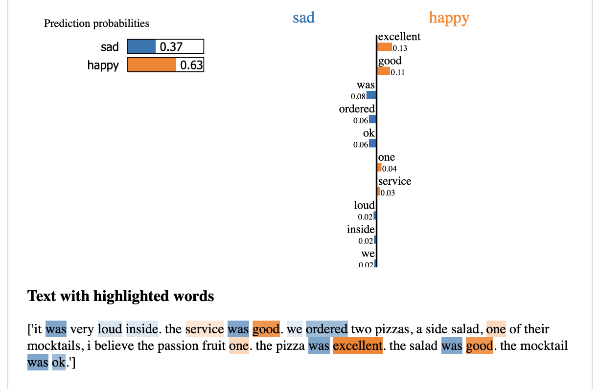

# Keywords in reviews
This is the application, that shows how happy was customer, when he was written the review for restaurant.   
It's highlighting keywords in reviews and shows weights of them for happiness or sadness mood in review. 




Launching steps:  
```
pip install -r requirements.txt
streamlit run app.py
```


